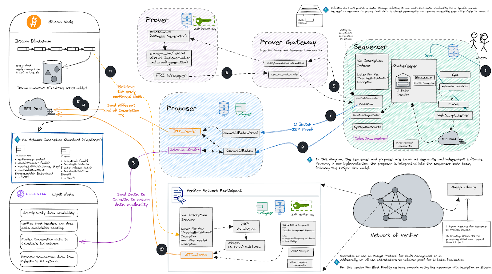

# Via Network: Bitcoin layer 2 solution

[](https://onvia.org/)

Via is a Bitcoin layer 2 solution that leverages Bitcoin's security while enhancing it's scalability. By utilizing the
modular [ZK Stack](https://docs.zksync.io/zk-stack) framework, the Via network provides an EVM-compatible execution
environment, allowing developers to deploy and execute smart contracts while ensuring transaction integrity through
Zero-Knowledge (ZK) Proofs.

As a Bitcoin rollup with a dedicated Verifier Network serving as the settlement layer, Via extends Bitcoin's
capabilities by introducing a scalable execution layer where transactions are processed efficiently before being
finalized. While the transaction data is published to [Celestia](https://celestia.org/), validity proofs verified on the
Via's Verifier Network ensure correctness and security. Unlike fully decentralized sovereign rollups, Via's Verifier
Network is currently permissioned, relying on a designated set of nodes for verification and settlement rather than the
open participation, making it a permissioned Sovereign Rollup.

This architecture is designed for the MVP, and we plan to make the network more trust-minimized and open to participants
in the future.

## Knowledge Index

The following questions are addressed in the resources below:

| Question                                                | Resource                                           |
| ------------------------------------------------------- | -------------------------------------------------- |
| Via Protocol Guides                                     | [guides](docs/via_guides/)                         |
| What do I need to develop the project locally?          | [development.md](docs/via_guides/development.md)   |
| How can I set up my dev environment?                    | [setup-dev.md](docs/guides/setup-dev.md)           |
| How can I run the project?                              | [launch.md](docs/guides/launch.md)                 |
| What is the logical project structure and architecture? | [architecture.md](docs/via_guides/architecture.md) |
| What Is the Data Flow in the Via Protocol?              | [data-flow.md](docs/via_guides/data-flow.md)       |
| Where can I find protocol specs?                        | Ping Via Team Members                              |
| Where can I find developer docs?                        | Ping Via Team Members                              |

## High Level Overview



This repository will contain code for the following components:

- Sequencer
- Proposer
- Prover
- Prover Gateway
- Verifier Network Node

`/core/bin` will contain the binaries for the above components with prefix `via_` e.g. `via_server` for Sequencer and
Proposer software.

Prover and Prover Gateway related code is in the directory `/prover`.

Verifier Network Node implementation can be found in the `/via_verifier` directory.

## Branches

- `main` is the main branch for the project. the code in this branch is the most stable and is used for production.
- `zksync-main`: this branch is equivalent to the zksync-era repo `main` branch.
- (feat/fix/chore)/`<branch-name>`: these branches are used for development and are merged into the `main` branch.
- release/`<version>`: these branches are used for release based on the `main` branch.

> Since we like to be updated with the latest changes in the zksync repo, we will periodically sync the `zksync-main`
> branch with the zksync repo and then merge the changes into the `main` branch. (rebase)

> We also adopt an approach to reduce the possibility of merge conflicts by adding a `via_` prefix to services and
> components that we add to the project and also creating our own new orchestration layer (binaries) for Via project.

```
git remote add upstream git@github.com:matter-labs/zksync-era.git
git checkout zksync-main
git pull upstream main
git checkout main
git rebase zksync-main
```

> This approach will change our git history, so we will need to force push to the `main` branch after the rebase. Please
> be careful when using this approach and communicate with the team before doing so.

## Disclaimer

The Via Protocol is under development and has not been audited yet. Please use the project or code of the project at
your own risk.
