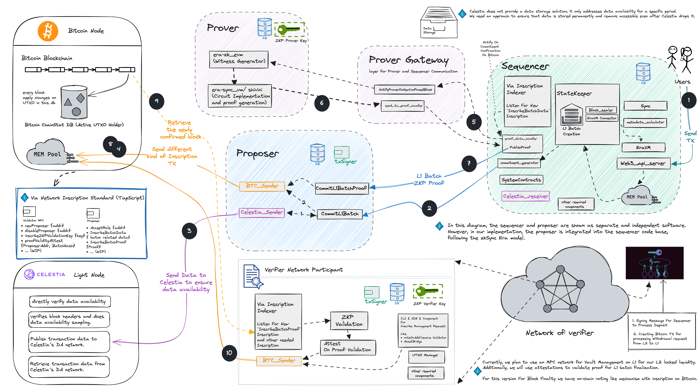

# Via Network: A L2 for Bitcoin 

Via Network is a Layer 2 scaling solution for Bitcoin that uses ZKP and DA approaches to scale the network. It is a fork of the
ZkSync project by Matter Labs. The project is currently in alpha state and is under active development.

## Knowledge Index

The following questions will be answered by the following resources:

| Question                                                | Resource                                       |
| ------------------------------------------------------- | ---------------------------------------------- |
| What do I need to develop the project locally?          | [development.md](docs/guides/development.md)   |
| How can I set up my dev environment?                    | [setup-dev.md](docs/guides/setup-dev.md)       |
| How can I run the project?                              | [launch.md](docs/guides/launch.md)             |
| What is the logical project structure and architecture? | [architecture.md](docs/guides/architecture.md) |
| Where can I find protocol specs?                        | Ping Via Team Members                          |    
| Where can I find developer docs?                        | Ping Via Team Members                          |

## High Level Overview

This repository will contain code for the following components:
- Sequencer
- Proposer
  - Via bitcoin inscription manager
- Prover
- Verifier network node
  - MPC manager

`/core/bin` will contain the binaries for the above components with prefix `via_` e.g. `via_server` for sequencer and  proposer software. 

Prover related code is in the  directory `/prover`.
## Disclaimer

The Via Network is under development and has not been audited. Please use the project or code of the project at your own risk.