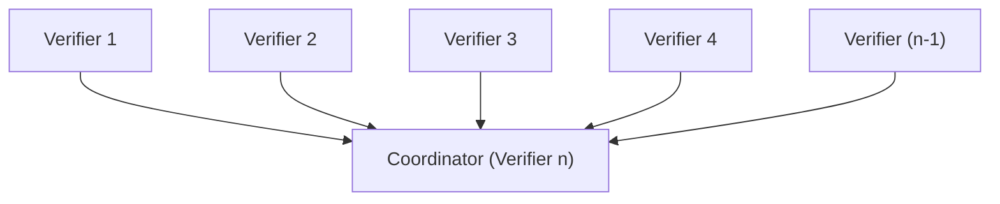
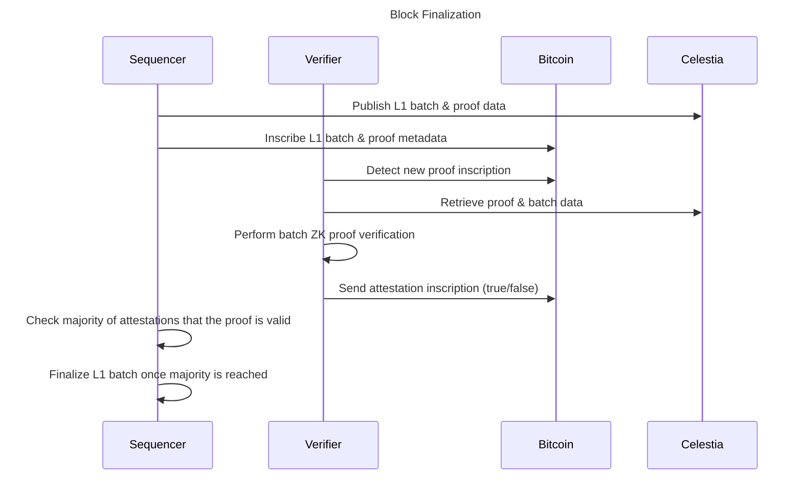
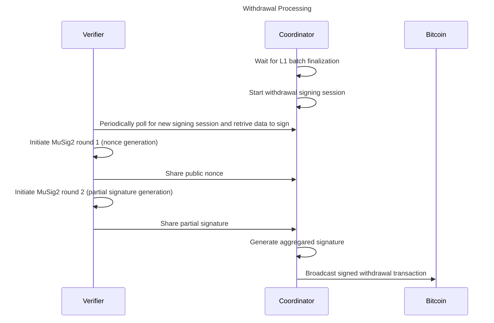

# Verifier Network

This document provides an overview of the Via Verifier Network architecture and main flows handled by the network
participants.

## Introduction

The Verifier Network is a crucial component of the Via Protocol, responsible for validating Zero-Knowledge (ZK) proofs
and ensuring the integrity of off-chain execution.

## Architecture Overview

The Verifier Network consists of multiple (n) **Verifier Nodes** with the main goal of verifying ZK (SNARK) proofs for
L1 batches, generated by the **Prover**. These nodes attest to the validity of the L2 state transitions, before the
batches are finalized and withdrawals are processed. One of the Verifier Nodes acts as a **Coordinator Node** whose main
responsibility is to manage the signing sessions and coordinate the Simple Two-Round Schnorr Multi-Signatures
([MuSig2](https://eprint.iacr.org/2020/1261)) process for transaction signing and broadcast the signed transaction to
the Bitcoin network.

## Verifier Network Flows

The following diagrams explain the roles of the Verifier Network partitipants in different flows.

### Block Finalization

- Batch and proof metadata are inscribed on the Bitcoin network by the Sequencer.
- Verifier detects the new proof inscription.
- It obtains the proof and batch data from the Celestia network.
- Batch proof verification is performed.
- After the verification, each Verifier Node sends the attestation inscription to the Bitcoin network.
- Once the required number of attestations (majority) is detected, indicating the ZK proof validity, the L1 batch is
  considered final.

### Withdrawal Processing

- After the L1 batch is final, Coordinator starts the withdrawal signing session.
- Each Verifier periodically polls the Coordinator API to obtain the new signign session.
- The Coordinator orchestrates the MuSig2 signing process.
- After the successful generation of the aggragated signature, Coordinator broadcasts the withdrawal transaction to the
  Bitcoin network.

## Design Limitations

- Current Verifier Network does not fully embody the ideals of a decentralized and trustless system. It operates with a
  fixed Coordinator role—held by one of the Verifiers—and utilizes n-of-n Schnorr signature scheme via MuSig2. This
  means that if any single Verifier becomes unresponsive, the entire network may face difficulties processing
  withdrawals. Moreover, the present architecture does not support dynamic addition or removal of Verifiers, which
  limits flexibility.
- Under the existing design, users must rely on the Verifier Network to process bridge transactions. This reliance is a
  temporary measure, and we plan to transition to more trust-minimized approach—potentially incorporating solutions like
  BitVM-based bridges and a more open Verifier Network—in subsequent phases.
