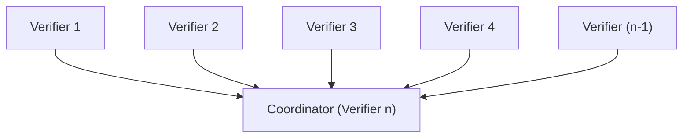
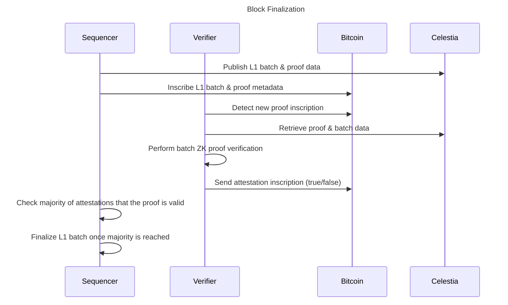

# Verifier Network

This document provides an overview of the Via Verifier Network architecture and main flows handled by the network
participants.

## Introduction

The Verifier Network is a crucial component of the Via Protocol, responsible for validating Zero-Knowledge (ZK) proofs
and ensuring the integrity of off-chain execution.

## Architecture Overview

The Verifier Network consists of multiple (n) **Verifier Nodes** with the main goal of verifying ZK (SNARK) proofs for
L1 batches, generated by the **Prover**. These nodes attest to the validity of the L2 state transitions, before the
batches are finalized and withdrawals are processed. One of the Verifier Nodes acts as a **Coordinator Node** whose main
responsibility is to manage the signing sessions and coordinate the Simple Two-Round Schnorr Multi-Signatures
([MuSig2](https://eprint.iacr.org/2020/1261)) process for transaction signing and broadcast the signed transaction to
the Bitcoin network.

```mermaid
graph TD
  Coordinator["Coordinator (Verifier n)"]

  Verifier1["Verifier 1"] --> Coordinator
  Verifier2["Verifier 2"] --> Coordinator
  Verifier3["Verifier 3"] --> Coordinator
  Verifier4["Verifier 4"] --> Coordinator
  VerifierN["Verifier (n-1)"] --> Coordinator
```

## Verifier Network Flows

The following diagrams explain the roles of the Verifier Network partitipants in different flows.

### Block Finalization

- Batch and proof metadata are inscribed on the Bitcoin network by the Sequencer.
- Verifier detects the new proof inscription.
- It obtains the proof and batch data from the Celestia network.
- Batch proof verification is performed.
- After the verification, each Verifier Node sends the attestation inscription to the Bitcoin network.
- Once the required number of attestations (majority) is detected, indicating the ZK proof validity, the L1 batch is
  considered final.

```mermaid
---
title: Block Finalization
---
sequenceDiagram
  participant Sequencer
  participant Verifier
  participant Bitcoin
  participant Celestia

  Sequencer->>Celestia: Publish L1 batch & proof data
  Sequencer->>Bitcoin: Inscribe L1 batch & proof metadata
  Verifier->>Bitcoin: Detect new proof inscription
  Verifier->>Celestia: Retrieve proof & batch data
  Verifier->>Verifier: Perform batch ZK proof verification
  Verifier->>Bitcoin: Send attestation inscription (true/false)
  Sequencer->>Sequencer: Check majority of attestations that the proof is valid
  Sequencer->>Sequencer: Finalize L1 batch once majority is reached
```

### Proof verification outcomes

The ZK verifier approves a batch when its package names the inscribed batch and the package's proof verifies.
Development mode, below, is the only other approval.
Anything else records nothing, so the verifier retries the same batch and progress stops there.
It records no rejections until proofs are bound to the inscribed batch ([ADR 0007](../docs/adr/0007-record-only-completed-proof-verdicts.md)).

- `via_verifier_zk_blocked_l1_batch` names the batch awaiting a verdict, and is 0 when none is pending. A nonzero value
  unchanged across polls means progress has stopped at that batch, including when a fetch hangs without an error.
- `via_verifier_zk_non_verdicts{reason}` counts polls that ended without a verdict. `package_unavailable`,
  `proof_unavailable` and `deposit_index_incomplete` usually resolve once evidence arrives or the index catches up.
  `malformed_package`, `proof_store_error`, `proof_failed`, `deposit_mismatch` and `verification_error` need an
  operator to inspect the logged cause.
- The package's `should_verify` flag never skips verification.

`proof_verification_dev_mode = true` in the verifier config lets local regtest runs without a prover approve a batch
whose proof is absent. A proof that is present is still verified. Development approvals are marked `unverified_dev`.

- The first start permanently designates the database for development or strict mode on one Bitcoin chain, even if
  that start then fails. Later starts in the other mode, or against another chain, refuse to run.
- Development mode requires regtest and a database without earlier verdicts. Use a fresh database for it.
- The designation migration refuses to roll back a development database. Discard that database instead.

### Withdrawal processing and coordinated cutover

The withdrawal lifecycle separates complete L2 obligations, observed Bitcoin payments, and durable signing
attempts. An observation can hold a request before its expected obligation arrives; it cannot create payment
authority. The following describes the candidate's operational contract, **not activation approval or runtime
verification**.

#### Configuration remains disabled

Under `[via_verifier]` in [`etc/env/base/via_verifier.toml`](../etc/env/base/via_verifier.toml):

| Setting | Default / requirement |
| --- | --- |
| `withdrawal_signing_enabled` | `false`; the signer and coordinator server wait without signing / serving rounds |
| `coordinator_public_key` | Empty; before enabling, set the coordinator's exact configured verifier public key |
| `withdrawal_fulfillment_confirmations` | Unset; fulfillment stays off until an explicitly approved positive depth is supplied |

No positive fulfillment depth has been selected here. This setting is independent of the watcher's ingestion
cutoff; setting it does not enable signing. Conversely, enabling signing does not select a fulfillment policy.
Disabled signing does not disable the verifier's withdrawal observation or wallet-boundary checks.

All participants must agree on the ordered, unique verifier public-key list, coordinator identity, Bitcoin network,
chain ID, bridge script and taproot tweak. The coordinator's configured private key must derive its configured
public key and belong to that list. Each verifier's local key must likewise map to its own participant index.
Authenticated envelopes bind exact body bytes, principal, audience, method, target, challenge, round and content;
responses bind back to the request. Snapshot polling uses `GET /session/`; nonce and signature batches use
`POST /session/nonce` and `POST /session/signature`. Only the coordinator principal may create a round through
`POST /session/new`. Old unsigned routes / payloads are not a compatible rolling-upgrade interface.

#### Migration, history and authority

Stop old withdrawal writers and signers together before applying the verifier
[`20260924000000_withdrawal_lifecycle` migration](lib/verifier_dal/migrations/20260924000000_withdrawal_lifecycle.up.sql).
It fences writes, deletes and truncates on the three legacy withdrawal tables. Legacy references become negative
quarantine holds, **not** trusted amounts, origins or paid flags. Preserve the old tables and all new attempt,
reservation, observation and conflict evidence. The down migration intentionally refuses automatic rollback:
restoring an old binary or deleting holds could authorize a second payment.

Take and verify a full database backup and rehearse the cutover on an isolated copy before upgrading an existing
network. Restoring a backup after proposals or signatures were exposed is not a safe rollback: reconcile all later
signing/payment evidence before reactivation so the restore cannot discard a possible payment.

The public indexer's separate `20260924000000_withdrawal_output_identity` migration changes output identity to
`(tx_id, vout)`; historical rows retain unknown vout rather than fabricated output provenance. It does not backfill
verifier authority or clear any verifier quarantine.

Complete history must be reconstructed and reconciled before activation, including legacy payment/signing risk
and observation coverage. There is no accepted activation-start-batch exemption. The importer considers finalized
source batches without a current complete marker across the retained history. Complete-empty is evidence, not
the same as missing DA, missing receipts or a failed import. The production import loop currently runs with the
enabled signer, not as an automatic disabled-mode backfill service; preparing and verifying history is a separate
preactivation requirement, not a reason to enable signing to bootstrap it.

[`WithdrawalClient`](lib/via_withdrawal_client/src/client.rs) binds complete DA pubdata to ordered L2 blocks,
transactions, receipts, service logs, messenger events and withdrawal events. It preserves full transaction-hash
and event-index origins and repeated-message multiplicity. Only after this association succeeds are unusable
receiver bytes classified as nonpayable: invalid UTF-8, invalid address or wrong Bitcoin network retain the raw
receiver, amount, origin and reason but never become eligible payouts. This creates no refund or top-up policy.
Incomplete or inconsistent evidence remains ineligible; the importer logs per-batch failures and continues to
later batches rather than turning failure into an empty batch.

Authority also requires the retained proof transaction, batch and blob to match a currently finalized successful
source. Changed evidence is retained as a conflict, not overwritten. Exact replay can revalidate the same source;
it cannot clear observation, conflict, legacy or signing-risk holds. Full pubdata and full receipts are deliberately
retained and compared as JSON evidence. Unrelated provider receipt-field drift can therefore cause a conservative
conflict; storage growth, replay stability and reconciliation of such drift remain operational concerns.

Withdrawal source authority retains proof inclusion, individual vote inclusions, and their latest scanned
height and block hash. Writers validate observed hashes against the locally accepted Bitcoin chain under
the invalidation gate; unknown provenance cannot be upgraded by a duplicate proof or a later vote.
Legacy and in-flight-at-migration rows without this coverage cannot authorize withdrawals and require
historical reconstruction before activation. A proof-only or vote-only reorg invalidates the affected
withdrawal source even when no deposit was removed. The reverter distinguishes this invalidation boundary
from proof-chain deletion: a vote-only reorg retains canonical proofs and pre-cut votes, removes suffix
votes, and reevaluates finalization using the retained verifier set. Re-mined votes can attach without
rewinding past a canonical proof. Removed proofs or deposit dependencies still delete the affected proof
chain inclusively. Proof-driven rejections and rejected competing forks are not reopened by vote pruning.
This is local accepted-chain validation, not a race-free canonical-at-signing guarantee.

The database binds one active withdrawal wallet and one chain/network/protocol domain. Before reconciliation or
Bitcoin polling, the watcher checks the current bridge wallet against that binding and any configured fulfillment
wallet. Rotation is not an automatic migration: wallet changes fail closed, stopping the watcher's shared cursor
(including other message processing), even with signing disabled. Domain changes also fail closed. Do not clear
the singleton records to bypass these checks; rotation requires separately reviewed reconciliation of old obligations
and holds.

#### Bitcoin evidence and fulfillment

Signing verifies full parent transaction bytes by txid and vout, not an untrusted prevout claim or `gettxout`.
Supplied proposal parents are accepted independently of their provider after byte verification; missing parents
use the Bitcoin RPC fallback. The current coordinator fetches its proposal parents through that RPC.
The verifier watcher uses required withdrawal scanning: its RPC needs historical full transactions, normally
Bitcoin Core with `txindex=1` and the relevant history available. Missing parents defer the scan; supplied signing
parents do not satisfy this separate watcher dependency. Same-block parents and repeated lookups are cached, but
third-party metadata can still impose historical-parent RPC work. The main-node watcher ignores withdrawals;
the public indexer uses best-effort recognition and is not the verifier's authority.

A recognized `VIA_WI` payment needs verified bridge-input provenance. Unknown, conflicting or nonconforming
payments hold the referenced obligations rather than authorizing a second payment. Fulfillment additionally
requires exact request-to-vout association, recipient and unchanged fee/net-amount construction, and an inclusion
joined to the canonical Bitcoin block at the selected positive confirmation depth. Witness differences permit a
conforming governance script-path payment; sequence and all other construction requirements remain exact.
Source invalidation, conflicting evidence or loss of accepted inclusion revokes fulfillment, while retained risk
continues to hold the obligation. Same-transaction canonical reinclusion may restore fulfillment.

Positive revalidation of that same payment is not post-signature reservation release. Inclusion uncertainty may
be resolved only by unique canonical inclusion plus fixed payment/source validation and the configured positive
depth; unrelated source-uncertainty holds still block fulfillment. No request/input risk is released and no
replacement payment is authorized by this transition.

**Governance payouts must use the shared `VIA_WI` authorization and observation path, or have an explicit durable
hold established before payout.** There is no automatic census of arbitrary no-metadata governance payouts.
A sweep of inputs is not proof that an obligation was paid; an unmarked payout can leave that obligation apparently
payable. Do not treat the governance example or an out-of-band transfer as reconciliation.

#### Signing and recovery

The signer retains a dedicated database connection owning its wallet lock; loss of ownership stops the task.
Admission reserves requests and inputs atomically. The coordinator persists exposure before publishing a proposal,
so its reservations survive restart even when another verifier signed first. Coin selection excludes retained
input reservations and observed inputs. Nonces and shares are persisted as complete public batches before export;
the durable `may_have_signed` marker precedes irreversible nonce consumption.

An unfinished in-memory round does not expire by age. Slow polling, source-import latency or a peer's
temporary admission failure keeps the same proposal and nonce transcript rather than repeatedly exposing
fresh requests and inputs. A positive observation of the proposed payment permits the next round, without
releasing the earlier payment's holds or suppressing exact rebroadcast. The obsolete `session_timeout`
setting has been removed. An unavailable participant or a returning participant that lost an unfinished
round's secret nonce can stop new proposals. If the coordinator has durable shares for that round, its
restart can restore a round that the retired peer can no longer complete. There is no automatic
abandonment protocol to advance past this state; offline reconciliation is required. Restarting is not
a safe way to reclaim the exposed round's inputs.

On restart, incomplete rounds retire without recreating their secret nonces. Reservations may release only for
retired, locally unsigned **and unexposed** attempts. Exposed or possibly signed attempts retain holds even when
no payment is visible. Signed recovery uses stored public transcripts and shares; finalized recovery rebroadcasts
the identical stored transaction bytes until canonical inclusion, without a fresh fee estimate or repricing.
A no-inclusion self-broadcast observation does not suppress exact rebroadcast. Per-record recovery failures are
logged without releasing that record's risk.

**Never automatically release exposed/signed holds because of timeout, mempool eviction, RPC absence, local
abandonment, restart, reorg, a new round ID or fresh inputs.** None proves that an earlier payment cannot land.
There is no automatic conflicting-spend release policy here. Preserve evidence and require explicit offline
reconciliation; recovery is not permission for replacement payouts, fee bumps or top-ups.

#### Preactivation checklist

Keep signing disabled and fulfillment depth unset until complete-history and legacy-risk reconciliation,
historical-parent availability, authenticated participant mapping, coordinated writer cutover, governance payout
discipline and the wallet-rotation boundary have been explicitly accepted. Independently approve a positive
fulfillment policy. Require final-snapshot evidence for migration fencing, source/reorg invalidation, concurrent
admission versus observation, authenticated multi-verifier signing, crash recovery, identical rebroadcast and
Bitcoin regtest acceptance. Source inspection and this guide do not establish those checks as passed.

## Design Limitations

- Current Verifier Network does not fully embody the ideals of a decentralized and trustless system. It operates with a
  fixed Coordinator role—held by one of the Verifiers—and utilizes n-of-n Schnorr signature scheme via MuSig2. This
  means that if any single Verifier becomes unresponsive, the entire network may face difficulties processing
  withdrawals. Moreover, the present architecture does not support dynamic addition or removal of Verifiers, which
  limits flexibility.
- Under the existing design, users must rely on the Verifier Network to process bridge transactions. This reliance is a
  temporary measure, and we plan to transition to more trust-minimized approach—potentially incorporating solutions like
  BitVM-based bridges and a more open Verifier Network—in subsequent phases.
